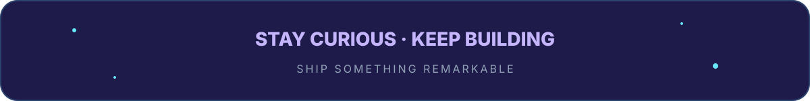

<!-- Built for github.com/rushiljaik -->

 

<a href="#-meet-rushil">About</a> ·
<a href="#-my-creative-arsenal">Skills</a> ·
<a href="#-selected-missions">Projects</a> ·
<a href="#-exploring-the-ai-frontier">AI Journey</a> ·
<a href="#-activity-mode">Activity</a>

  

  

## ⚡ Meet Rushil

Hey! I’m **Rushil Jai Krishan Pandita** — a web developer, creative builder, and relentlessly curious problem solver.

I turn ideas into **interactive digital experiences**. Sometimes that means building a full campus platform. Sometimes it means bringing a 3D RGB keyboard to life in the browser. Right now, I’m pushing deeper into AI and learning how intelligent systems can make software more useful, intuitive, and exciting.

> I’m not here just to collect technologies. I’m here to combine code, design, and curiosity into things people actually enjoy using.

| 🎯 What I build | 🧠 What I’m exploring | 🚀 How I work |
| :--: | :--: | :--: |
| Interactive web products | AI, LLMs & intelligent tools | Build → test → improve → ship |
| Campus and community platforms | Python-powered AI applications | Learn fast and think in public |
| Creative 3D experiences | Human-centered automation | Make every project better than the last |

<b>🛰️ A little more about my journey</b>

 

I love projects that sit at the intersection of engineering, design, and real-world usefulness. My work so far includes role-based dashboards, AI-assisted code review, resource-sharing systems, data visualizations, and browser-based 3D interaction.

Every repository is part of the same mission: **learn something difficult, build something real, and leave it better documented than I found it.**

## 🧰 My creative arsenal

### Languages I speak

### Tools I build with

### My developer cockpit

## 🛸 Selected missions

 

<b>🔍 Open the mission files</b>

 

- **CampusAI ERP** — a responsive college system with distinct student, faculty, and admin experiences.
- **RGB Gaming Keyboard** — an interactive Three.js model with real key presses, an exploded view, orbit controls, and model export.
- **CodeSage-AI** — an AI-powered pull-request review platform designed to detect bugs and security issues.
- **Campus Circular** — a resource-sharing experience with discovery, smart matching, trust scores, and complete borrowing flows.

## 🧠 Exploring the AI frontier

AI is my current learning frontier. I’m exploring it as a **builder**, not just a spectator.

- 🤖 Experimenting with large language models and AI-assisted workflows
- 🐍 Connecting models to real products using Python and APIs
- 🔎 Building intelligent developer tools such as CodeSage-AI
- 🧩 Learning prompt design, AI agents, and thoughtful automation
- 🌍 Looking for practical problems where AI genuinely improves the experience

> **Current quest:** build strong software foundations, understand AI deeply, and combine both into ambitious products.

## 🐍 Activity mode

<picture>
  <source media="(prefers-color-scheme: dark)" srcset="https://raw.githubusercontent.com/rushiljaik/rushiljaik/output/github-contribution-grid-snake-dark.svg" />
  <source media="(prefers-color-scheme: light)" srcset="https://raw.githubusercontent.com/rushiljaik/rushiljaik/output/github-contribution-grid-snake.svg" />
  
</picture>

 

## 🌌 Let’s build something unforgettable

I’m always open to interesting ideas, open-source collaboration, ambitious experiments, and conversations about the future of the web and AI.

<a href="https://github.com/rushiljaik"><b>Follow the journey</b></a>
&nbsp; • &nbsp;
<a href="https://github.com/rushiljaik?tab=repositories"><b>Enter the project lab</b></a>

  

