<!--
  GITHUB PROFILE README
  Personalized for github.com/rushiljaik.
  Create a public repository named rushiljaik, then copy this file, assets/,
  and .github/ into it to make this appear on your GitHub profile.
-->

<div align="center">

<a href="https://github.com/rushiljaik">
  
</a>

<br />

<a href="#about-me">About</a> ·
<a href="#toolbox">Toolbox</a> ·
<a href="#exploring-ai">AI</a> ·
<a href="#featured-work">Projects</a> ·
<a href="#github-at-a-glance">Stats</a> ·
<a href="#lets-connect">Contact</a>

<br /><br />

<a href="https://github.com/rushiljaik?tab=followers">
  
</a>
<a href="https://github.com/rushiljaik?tab=repositories">
  
</a>

</div>

## About me

```js
const rushil = {
  fullName: "Rushil Jai Krishan Pandita",
  role: "Web Developer & Builder",
  languages: ["HTML", "CSS", "JavaScript", "Java", "Python"],
  currentlyBuilding: "Interactive web products and useful software",
  exploring: ["Artificial Intelligence", "LLMs", "AI-powered applications"],
  interests: ["Creative coding", "Product design", "Useful automation"],
  goal: "Combine solid development skills with practical AI"
};
```

<details>
<summary><b>More about my journey</b></summary>
<br />

I know **HTML, CSS, JavaScript, Java, and Python**, and I use them to build interactive web experiences and practical software prototypes. My recent work ranges from a role-based college ERP and a campus resource-sharing platform to an AI code-review tool and a fully interactive 3D RGB keyboard.

</details>

## Toolbox

<div align="center">


</div>

<details>
<summary><b>How I like to work</b></summary>
<br />

- Start with the user and the problem.
- Prototype quickly, then simplify deliberately.
- Prefer readable systems over clever ones.
- Document decisions so the next person can move faster.

</details>

## Exploring AI

I am currently learning how to create useful experiences with **artificial intelligence**—from understanding large language models to adding intelligent features to real applications.

- Building and experimenting with AI-powered developer tools
- Exploring LLMs, prompting, and AI-assisted workflows
- Learning how Python and APIs connect AI models to products
- Interested in practical AI that solves real problems

> My current direction: stronger software fundamentals + thoughtful AI = products that are genuinely useful.

## Featured work

<div align="center">

<a href="https://github.com/rushiljaik/campus-erp-website">
  
</a>
<a href="https://github.com/rushiljaik/gaming-keyboard-3d-animation">
  
</a>

</div>

<details>
<summary><b>Explore more projects</b></summary>
<br />

| Project | What it does | Built with |
| :-- | :-- | :-- |
| [CampusAI ERP](https://github.com/rushiljaik/campus-erp-website) | A responsive college ERP with student, faculty, and admin experiences. | React, Vite, Tailwind CSS |
| [RGB Gaming Keyboard](https://github.com/rushiljaik/gaming-keyboard-3d-animation) | An interactive 3D TKL keyboard with key presses, exploded view, and model export. | JavaScript, Three.js |
| [CodeSage-AI](https://github.com/rushiljaik/codessage-ai-) | An AI-powered pull-request review platform for finding bugs and security issues. | Python, FastAPI, React, LLMs |
| [Campus Circular](https://github.com/rushiljaik/campus-circular) | A campus resource-sharing prototype with discovery, matching, trust, and borrowing flows. | JavaScript, Canvas, Node.js |

</details>

## GitHub at a glance

<div align="center">

<picture>
  <source media="(prefers-color-scheme: dark)" srcset="https://github-readme-stats.vercel.app/api?username=rushiljaik&show_icons=true&hide_border=true&rank_icon=github&include_all_commits=true&theme=transparent&title_color=a78bfa&icon_color=22d3ee&text_color=cbd5e1" />
  <source media="(prefers-color-scheme: light)" srcset="https://github-readme-stats.vercel.app/api?username=rushiljaik&show_icons=true&hide_border=true&rank_icon=github&include_all_commits=true&theme=transparent&title_color=6d28d9&icon_color=0891b2&text_color=334155" />
  
</picture>
<picture>
  <source media="(prefers-color-scheme: dark)" srcset="https://github-readme-stats.vercel.app/api/top-langs/?username=rushiljaik&layout=compact&hide_border=true&theme=transparent&title_color=a78bfa&text_color=cbd5e1" />
  <source media="(prefers-color-scheme: light)" srcset="https://github-readme-stats.vercel.app/api/top-langs/?username=rushiljaik&layout=compact&hide_border=true&theme=transparent&title_color=6d28d9&text_color=334155" />
  
</picture>

<br />

<picture>
  <source media="(prefers-color-scheme: dark)" srcset="https://raw.githubusercontent.com/rushiljaik/rushiljaik/output/github-contribution-grid-snake-dark.svg" />
  <source media="(prefers-color-scheme: light)" srcset="https://raw.githubusercontent.com/rushiljaik/rushiljaik/output/github-contribution-grid-snake.svg" />
  
</picture>

</div>

## Let's connect

I am always happy to talk about interactive web projects, AI-assisted development, and new ideas. Follow along or explore one of my repositories.

<div align="center">

<a href="https://github.com/rushiljaik"><b>GitHub profile</b></a>
&nbsp;·&nbsp;
<a href="https://github.com/rushiljaik?tab=repositories"><b>All repositories</b></a>

<br /><br />


<br /><br />

<i>Thanks for stopping by. Explore a project, open an issue, or just say hello.</i>

</div>
